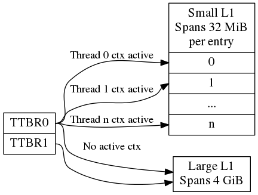

.. _core:

Core
====

.. _interrupt_handling:

Interrupt handling
^^^^^^^^^^^^^^^^^^

.. _memory_objects:

Memory objects
^^^^^^^^^^^^^^
A memory object, **MOBJ**, describes a piece of memory. The interface provided
is mostly abstract when it comes to using the MOBJ to populate translation
tables etc. There are different kinds of MOBJs describing:

    - Physically contiguous memory
        - created with ``mobj_phys_alloc()``.
    - Virtual memory
        - one instance with the name ``mobj_virt`` available.
        - spans the entire virtual address space.
    - Physically contiguous memory allocated from a ``tee_mm_pool_t *``
        - created with ``mobj_mm_alloc()``.
    - Paged memory
        - created with ``mobj_paged_alloc()``.
        - only contains the supplied size and makes ``mobj_is_paged()`` return
          true if supplied as argument.
    - Secure copy paged shared memory
        - created with ``mobj_seccpy_shm_alloc()``.
        - makes ``mobj_is_paged()`` and ``mobj_is_secure()`` return true if
          supplied as argument.

.. _mmu:

MMU
^^^

Translation tables
~~~~~~~~~~~~~~~~~~
OP-TEE uses several L1 translation tables, one large spanning 4 GiB and two or
more small tables spanning 32 MiB. The large translation table handles kernel
mode mapping and matches all addresses not covered by the small translation
tables. The small translation tables are assigned per thread and covers the
mapping of the virtual memory space for one TA context.

Memory space between small and large translation table is configured by TTBRC.
TTBR1 always points to the large translation table. TTBR0 points to the a small
translation table when user mapping is active and to the large translation table
when no user mapping is currently active. For details about registers etc,
please refer to a Technical Reference Manual for your architecture, for example
`Cortex-A53 TRM`_.

The translation tables has certain alignment constraints, the alignment (of the
physical address) has to be the same as the size of the translation table. The
translation tables are statically allocated to avoid fragmentation of memory due
to the alignment constraints.

Each thread has one small L1 translation table of its own. Each TA context has a
compact representation of its L1 translation table. The compact representation
is used to initialize the thread specific L1 translation table when the TA
context is activated.

Switching to user mode
~~~~~~~~~~~~~~~~~~~~~~
This section only applies with following configuration flags:

    - ``CFG_WITH_LPAE=n``
    - ``CFG_CORE_UNMAP_CORE_AT_EL0=y``

When switching to user mode only a minimal kernel mode mapping is kept. This is
achieved by selecting a zeroed out big L1 translation in TTBR1 when
transitioning to user mode. When returning back to kernel mode the original L1
translation table is restored in TTBR1.

Switching to normal world
~~~~~~~~~~~~~~~~~~~~~~~~~
When switching to normal world either via a foreign interrupt or RPC there is a
chance that secure world will resume execution on a different CPU. This means
that the new CPU need to be configured with the context of the currently active
TA. This is solved by always setting the TA context in the CPU when resuming
execution. Here is room for improvements since it is more likely than not that
it is the same CPU that resumes execution in secure world.

.. _pager:

Pager
^^^^^

.. _stacks:

Stacks
^^^^^^

.. _shared_memory:

Shared Memory
^^^^^^^^^^^^^

.. _smc:

SMC
^^^
SMC Interface
~~~~~~~~~~~~~
OP-TEE's SMC interface is defined in two levels using optee_smc.h_ and
optee_msg.h_. The former file defines SMC identifiers and what is passed in the
registers for each SMC. The latter file defines the OP-TEE Message protocol
which is not restricted to only SMC even if that currently is the only option
available.

SMC communication
~~~~~~~~~~~~~~~~~
The main structure used for the SMC communication is defined in ``struct
optee_msg_arg`` (in optee_msg.h_). If we are looking into the source code, we
could see that communication mainly is achieved using ``optee_msg_arg`` and
``thread_smc_args`` (in thread.h_), where ``optee_msg_arg`` could be seen as the
main structure. What will happen is that the :ref:`linux_kernel` driver will get
the parameters either from :ref:`optee_client` or directly from an internal
service in Linux kernel. The TEE driver will populate the struct
``optee_msg_arg`` with the parameters plus some additional bookkeeping
information.  Parameters for the SMC are passed in registers 1 to 7, register 0
holds the SMC id which among other things tells whether it is a standard or a
fast call.

.. _thread_handling:

Thread handling
^^^^^^^^^^^^^^^

.. _optee_smc.h: https://github.com/OP-TEE/optee_os/blob/master/core/arch/arm/include/sm/optee_smc.h
.. _optee_msg.h: https://github.com/OP-TEE/optee_os/blob/master/core/include/optee_msg.h
.. _thread.h: https://github.com/OP-TEE/optee_os/blob/master/core/arch/arm/include/kernel/thread.h

.. _Cortex-A53 TRM: http://infocenter.arm.com/help/topic/com.arm.doc.ddi0500j/DDI0500J_cortex_a53_trm.pdf
