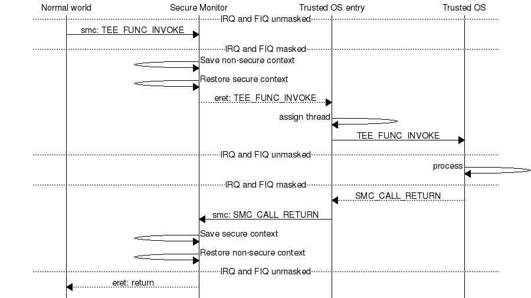
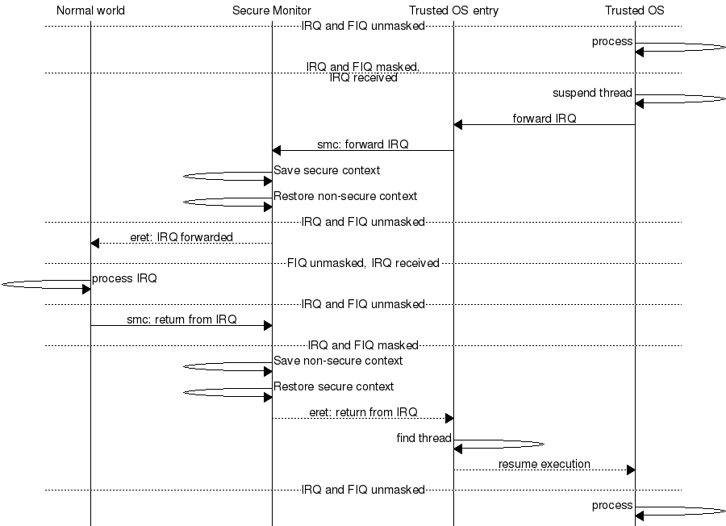
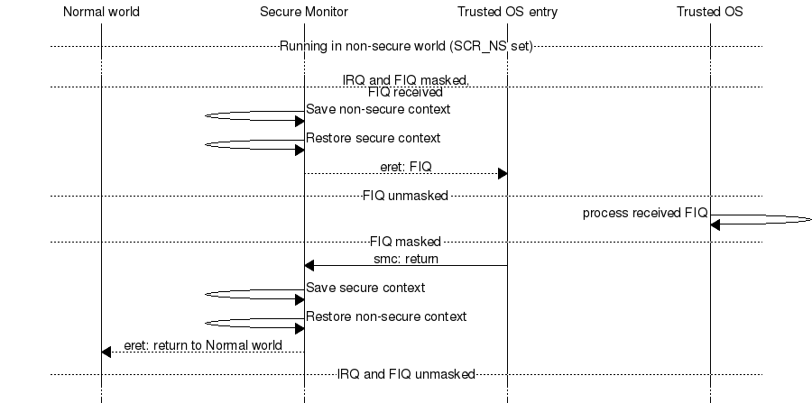
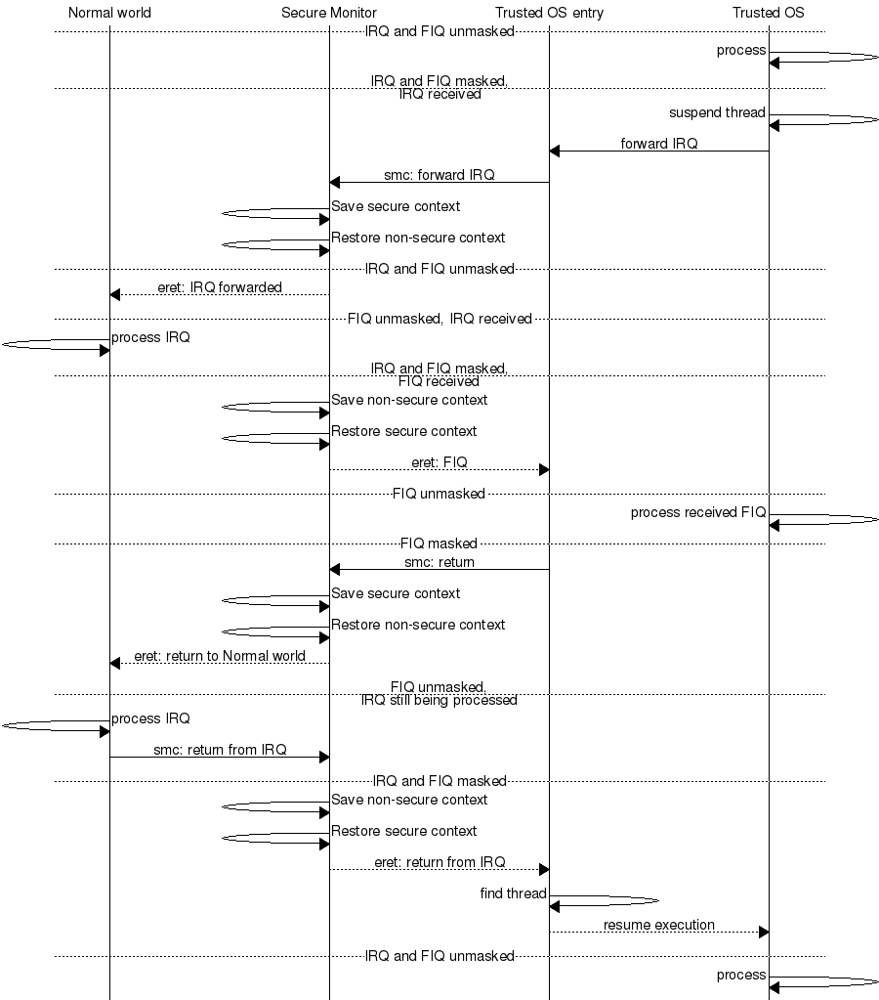

This document describes how :ref:`optee_os` handles switches of world execution
context based on :ref:`SMC` exceptions and interrupt notifications Interrupt
notifications are IRQ/FIQ exceptions which may also imply switching of world
execution context: normal world to secure world, or secure world to normal
world.

Use cases of world context switch
=================================
This section lists all the cases where optee_os is involved in world context
switches. Optee_os executes in the secure world. World switch is done by the
cores secure monitor level/mode, referred below as the Monitor.

When the normal world invokes the secure world, the normal world executes a SMC
instruction. The SMC exception is always trapped by the Monitor. If the related
service targets the trusted OS, the Monitor will switch to optee_os world
execution. When the secure world returns to the normal world, optee_os executes
a SMC that is caught by the Monitor which switches back to the normal world.

When a secure interrupt is signaled by the Arm GIC, it shall reach the optee_os
interrupt exception vector. If the secure world is executing, optee_os will
handle straight the interrupt from its exception vector. If the normal world is
executing when the secure interrupt raises, the Monitor vector must handle the
exception and invoke the optee_os to serve the interrupt.

When a non-secure interrupt is signaled by the Arm GIC, it shall reach the
normal world interrupt exception vector. If the normal world is executing, it
will handle straight the exception from its exception vector. If the secure
world is executing when the non-secure interrupt raises, optee_os will
temporarily return back to normal world via the Monitor to let normal world
serve the interrupt.

Core exception vectors
======================
Monitor vector is ``VBAR_EL3`` in AArch64 and ``MVBAR`` in Armv7-A/AArch32.
Monitor can be reached while normal world or secure world is executing. The
executing secure state is known to the Monitor through the ``SCR_NS``.

Monitor can be reached from a SMC exception, an IRQ or FIQ exception (so-called
interrupts) and from asynchronous aborts. Obviously monitor aborts (data,
prefetch, undef) are local to the Monitor execution.

The Monitor can be external to optee_os (case ``CFG_WITH_ARM_TRUSTED_FW=y``).
If not, provides a local secure monitor ``core/arch/arm/sm``. Armv7-A platforms
should use the optee_os secure monitor. Armv8-A platforms are likely to rely on
an `Trusted Firmware A`_.

When executing outside the Monitor, the system is executing either in the
normal world (``SCR_NS=1``) or in the secure world (``SCR_NS=0``). Each world
owns its own exception vector table (state vector):

    - ``VBAR_EL2`` or ``VBAR_EL1`` non-secure or ``VBAR_EL1`` secure for
      AArch64.
    - ``HVBAR`` or ``VBAR`` non-secure or ``VBAR`` secure for Armv7-A and
      AArch32.

All SMC exceptions are trapped in the Monitor vector. IRQ/FIQ exceptions can be
trapped either in the Monitor vector or in the state vector of the executing
world.

When the normal world is executing, the system is configured to route:

    - secure interrupts to the Monitor that will forward to optee_os
    - non-secure interrupts to the executing world exception vector.

When the secure world is executing, the system is configured to route:

    - secure and non-secure interrupts to the executing optee_os exception
      vector. optee_os shall forward the non-secure interrupts to the normal
      world.

Optee_os non-secure interrupts are always trapped in the state vector of the
executing world. This is reflected by a static value of ``SCR_(IRQ|FIQ)``.

.. _native_foreign_irqs:

Native and foreign interrupts
=============================
Two types of interrupt are defined in optee_os:

    - **Native interrupt** - The interrupt handled by optee_os (for example:
      secure interrupt)
    - **Foreign interrupt** - The interrupt not handled by optee_os (for
      example: non-secure interrupt which is handled by normal world)

For Arm **GICv2** mode, native interrupt is sent as FIQ and foreign interrupt
is sent as IRQ. For Arm **GICv3** mode, foreign interrupt is sent as FIQ which
could be handled by either secure world (aarch32 Monitor mode or aarch64 EL3)
or normal world. Arm GICv3 mode can be enabled by setting ``CFG_ARM_GICV3=y``.
For clarity, this document mainly chooses the GICv2 convention and refers the
IRQ as optee_os foreign interrupts, and FIQ as optee_os native interrupts.
Native interrupts must be securely routed to optee_os. Foreign interrupts, when
trapped during secure world execution might need to be efficiently routed to
the normal world.

Normal World invokes optee_os using SMC
=======================================

**Entering the Secure Monitor**

The monitor manages all entries and exits of secure world. To enter secure
world from normal world the monitor saves the state of normal world (general
purpose registers and system registers which are not banked) and restores the
previous state of secure world. Then a return from exception is performed and
the restored secure state is resumed. Exit from secure world to normal world is
the reverse.

Some general purpose registers are not saved and restored on entry and exit,
those are used to pass parameters between secure and normal world (see
ARM_DEN0028A_SMC_Calling_Convention_ for details).

**Entry and exit of Trusted OS**

On entry and exit of Trusted OS each CPU is uses a separate entry stack and runs
with IRQ and FIQ blocked. SMCs are categorised in two flavors: **fast** and
**standard**.

    - For **fast** SMCs, optee_os will execute on the entry stack with IRQ/FIQ
      blocked until the execution returns to normal world.

    - For **standard** SMCs, optee_os will at some point execute the requested
      service with interrupts unblocked. In order to handle interrupts, mainly
      forwarding of foreign interrupts, optee_os assigns a trusted thread
      (`core/arch/arm/kernel/thread.c`_) to the SMC request. The trusted thread
      stores the execution context of the requested service. This context can be
      suspended and resumed as the requested service executes and is
      interrupted. The trusted thread is released only once the service
      execution returns with a completion status.

      For **standard** SMCs, optee_os allocates or resumes a trusted thread then
      unblock the IRQ/FIQ lines. When the optee_os needs to invoke the normal
      world from a foreign interrupt or a remote service call, optee_os blocks
      IRQ/FIQ and suspends the trusted thread. When suspending, optee_os gets
      back to the entry stack.

    - **Both** fast and standard SMC end on the entry stack with IRQ/FIQ blocked
      and optee_os invokes the Monitor through a SMC to return to the normal
      world.

    
    SMC entry to secure world

Deliver non-secure interrupts to Normal World
=============================================
This section uses the Arm GICv1/v2 conventions: IRQ signals non-secure
interrupts while FIQ signals secure interrupts. On a GICv3 configuration, one
should exchange IRQ and FIQ in this section.

**Forward a Foreign Interrupt from Secure World to Normal World**

When an IRQ is received in secure world as an IRQ exception then secure world:

    1. Saves trusted thread context (entire state of all processor modes for
       Armv7-A)

    2. Blocks (masks) all interrupts (IRQ and FIQ)

    3. Switches to entry stack

    4. Issues an SMC with a value to indicates to normal world that an IRQ has
       been delivered and last SMC call should be continued

The monitor restores normal world context with a return code indicating that an
IRQ is about to be delivered. Normal world issues a new SMC indicating that it
should continue last SMC.

The monitor restores secure world context which locates the previously saved
context and checks that it is a return from IRQ that is requested before
restoring the context and lets the secure world IRQ handler return from
exception where the execution would be resumed.

Note that the monitor itself does not know/care that it has just forwarded an
IRQ to normal world. The bookkeeping is done in the trusted thread handling in
Trusted OS. Normal world is responsible to decide when the secure world thread
should resume execution (for details, see :ref:`thread_handling`).

    
    IRQ received in secure world and forwarded to normal world

**Deliver a non-secure interrupt to normal world when ``SCR_NS`` is set**

Since ``SCR_IRQ`` is cleared, an IRQ will be delivered using the state vector
(``VBAR``) in the normal world. The IRQ is received as any other exception by
normal world, the monitor and the Trusted OS are not involved at all.

Deliver secure interrupts to Secure World
=========================================
This section uses the Arm GICv1/v2 conventions: FIQ signals secure interrupts
while IRQ signals non-secure interrupts. On a GICv3 configuration, one should
exchange IRQ and FIQ in this section. A FIQ can be received during two different
states, either in normal world (``SCR_NS`` is set) or in secure world
(``SCR_NS`` is cleared). When the secure monitor is active (Armv8-A EL3 or
Armv7-A Monitor mode) FIQ is masked. FIQ reception in the two different states
is described below.

**Deliver FIQ to secure world when SCR_NS is set**

When the monitor gets an FIQ exception it:

    1. Saves normal world context and restores secure world context from last
       secure world exit (which will have IRQ and FIQ blocked)
    2. Clears ``SCR_FIQ`` when clearing ``SCR_NS``
    3. Sets “FIQ” as parameter to secure world entry
    4. Does a return from exception into secure context
    5. Secure world unmasks FIQs because of the “FIQ” parameter
    6. FIQ is received as in exception using the state vector
    7. The state vector handle returns from exception in secure world
    8. Secure world issues an SMC to return to normal world
    9. Monitor saves secure world context and restores normal world context
    10. Does a return from exception into restored context

    FIQ received when SCR_NS is set

    FIQ received while processing an IRQ forwarded from secure world

**Deliver FIQ to secure world when SCR_NS is cleared**

Since ``SCR_FIQ`` is cleared when ``SCR_NS`` is cleared a FIQ will be delivered
using the state vector (``VBAR``) in secure world. The FIQ is received as any
other exception by Trusted OS, the monitor is not involved at all.

Trusted thread scheduling
=========================
**Trusted thread for standard services**

OP-TEE standard services are carried through standard SMC. Execution of these
services can be interrupted by foreign interrupts. To suspend and restore the
service execution, optee_os assigns a trusted thread at standard SMCs entry.

The trusted thread terminates when optee_os returns to the normal world with a
service completion status.

A trusted thread execution can be interrupted by a native interrupt. In this
case the native interrupt is handled by the interrupt exception handlers and
once served, optee_os returns to the execution trusted thread.

A trusted thread execution can be interrupted by a foreign interrupt. In this
case, optee_os suspends the trusted thread and invokes the normal world through
the Monitor (optee_os so-called RPC services). The trusted threads will resume
only once normal world invokes the optee_os with the RPC service status.

A trusted thread execution can lead optee_os to invoke a service in normal
world: access a file, get the REE current time, etc. The trusted thread is
suspended/resumed during remote service execution.

**Scheduling considerations**

When a trusted thread is interrupted by a foreign interrupt and when optee_os
invokes a normal world service, the normal world gets the opportunity to
reschedule the running applications. The trusted thread will resume only once
the client application is scheduled back. Thus, a trusted thread execution
follows the scheduling of the normal world caller context.

Optee_os does not implement any thread scheduling. Each trusted thread is
expected to track a service that is invoked from the normal world and should
return to it with an execution status.

The OP-TEE Linux driver (as implemented in `drivers/tee/optee`_ since Linux
kernel 4.12) is designed so that the Linux thread invoking OP-TEE gets assigned
a trusted thread on TEE side. The execution of the trusted thread is tied to the
execution of the caller Linux thread which is under the Linux kernel scheduling
decision. This means trusted threads are scheduled by the Linux kernel.

**Trusted thread constraints**

TEE core handles a static number of trusted threads, see ``CFG_NUM_THREADS``.

Trusted threads are only expensive on memory constrained system, mainly
regarding the execution stack size.

On SMP systems, optee_os can execute several trusted threads in parallel if the
normal world supports scheduling of processes. Even on UP systems, supporting
several trusted threads in optee_os helps normal world scheduler to be
efficient.

.. _core/arch/arm/kernel/thread.c: https://github.com/OP-TEE/optee_os/blob/master/core/arch/arm/kernel/thread.c
.. _drivers/tee/optee: https://github.com/torvalds/linux/tree/master/drivers/tee/optee

.. _Trusted Firmware A: https://github.com/ARM-software/arm-trusted-firmware
.. _ARM_DEN0028A_SMC_Calling_Convention: http://infocenter.arm.com/help/topic/com.arm.doc.den0028b/ARM_DEN0028B_SMC_Calling_Convention.pdf
